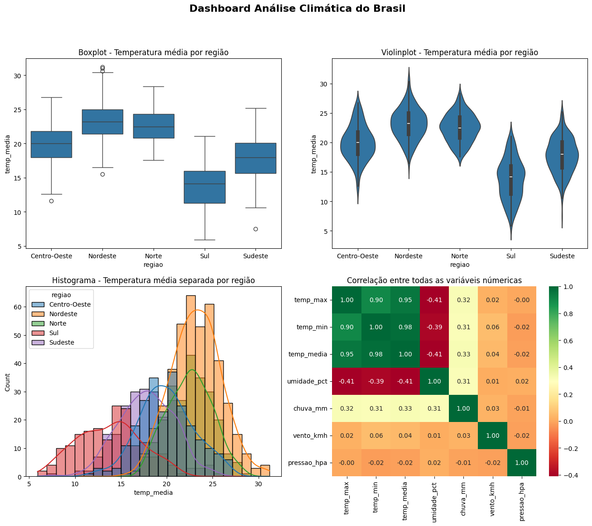

# 🌦️ Análise Climática Brasileira

Análise exploratória de dados climáticos históricos de 22 cidades
brasileiras distribuídas nas 5 regiões do país, cobrindo o período
de 2020 a 2024.

## 📊 Dashboard



## 📝 Relatório
```
==================================================
   RELATÓRIO  — ANÁLISE CLIMÁTICA
==================================================
 Período   : 01/01/2020 a 01/12/2024
 Registros : 1,320 medições
--------------------------------------------------
  TEMPERATURA
    Média geral   : 20.2 °C
    Máxima média  : 24.8 °C
    Mínima média  : 15.6 °C
--------------------------------------------------
  PRECIPITAÇÃO
    Chuva média    : 142.5 mm
    Total acumulado: 188,135 mm
--------------------------------------------------
  UMIDADE E VENTO
    Umidade média  : 70.7%
    Vento médio    : 20.2 km/h
--------------------------------------------------
  ANÁLISE REGIONAL
    Região mais quente : Nordeste
    Região mais fria   : Sul
    Região mais chuvosa: Norte
--------------------------------------------------
  DESTAQUES
     Mês mais quente   : Abril
     Mês mais frio     : Outubro
     Mês mais chuvoso  : Junho
     Cidade mais ventosa: Manaus
==================================================
```

## Sobre o projeto

O objetivo foi investigar padrões climáticos regionais do Brasil,
comparar temperaturas entre regiões e validar diferenças
estatisticamente — simulando uma análise real de dados ambientais.

## 🔎 O que foi feito

- Limpeza de dados: nulos, outliers de temperatura e inconsistências
- Análise exploratória por região com groupby e pivot tables
- Teste de hipótese (t-test): Nordeste vs Sul — diferença de 9.4°C
- Amostragem aleatória simples (5%, 10% e 30%) vs população completa
- Amostragem estratificada por região
- Dashboard visual com boxplot, violinplot, histograma e heatmap

## 📈 Principais descobertas

- Nordeste é a região mais quente (23.2°C de média anual)
- Sul é a mais fria (13.8°C) — diferença de 9.4°C confirmada pelo t-test
- Norte é a região mais chuvosa (média de 252mm por mês)
- O p-value do teste foi ≈ 0.0 — diferença estatisticamente significativa
- Amostras de 10% representam bem regiões com muitos dados,
  mas sub-representam regiões menores como o Sul

## 🛠️ Ferramentas utilizadas

- Python, pandas, numpy
- matplotlib, seaborn
- scipy (teste de hipótese)
- Jupyter Notebook

## Como executar

1. Clone o repositório
2. Instale as dependências:
   `pip install pandas numpy matplotlib seaborn scipy`
3. Abra o notebook no Jupyter ou Google Colab
